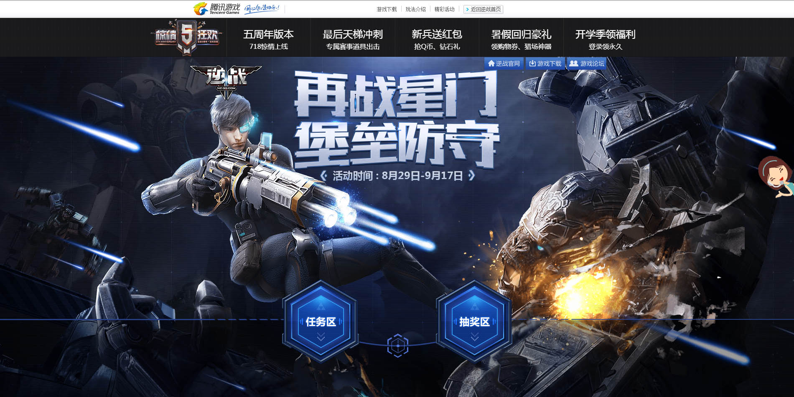
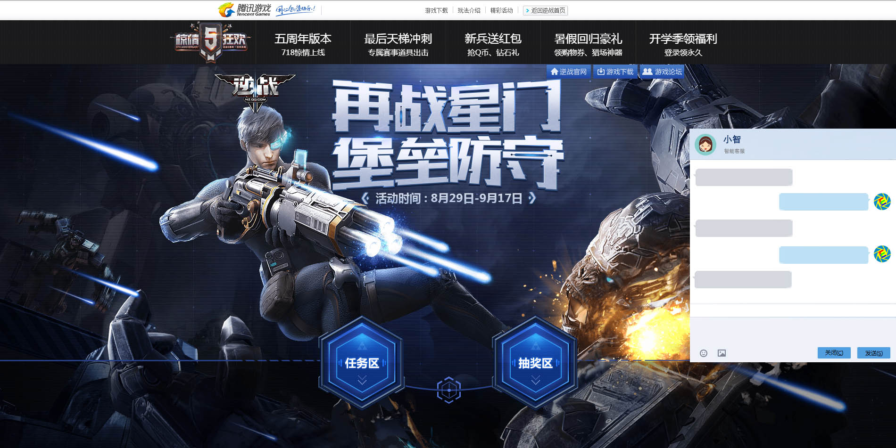
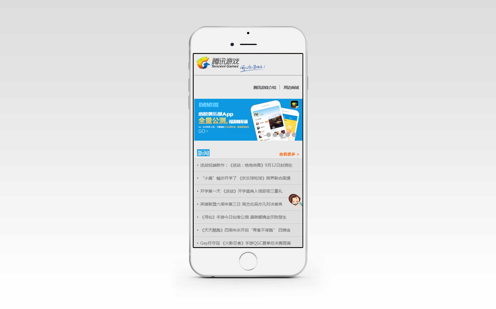
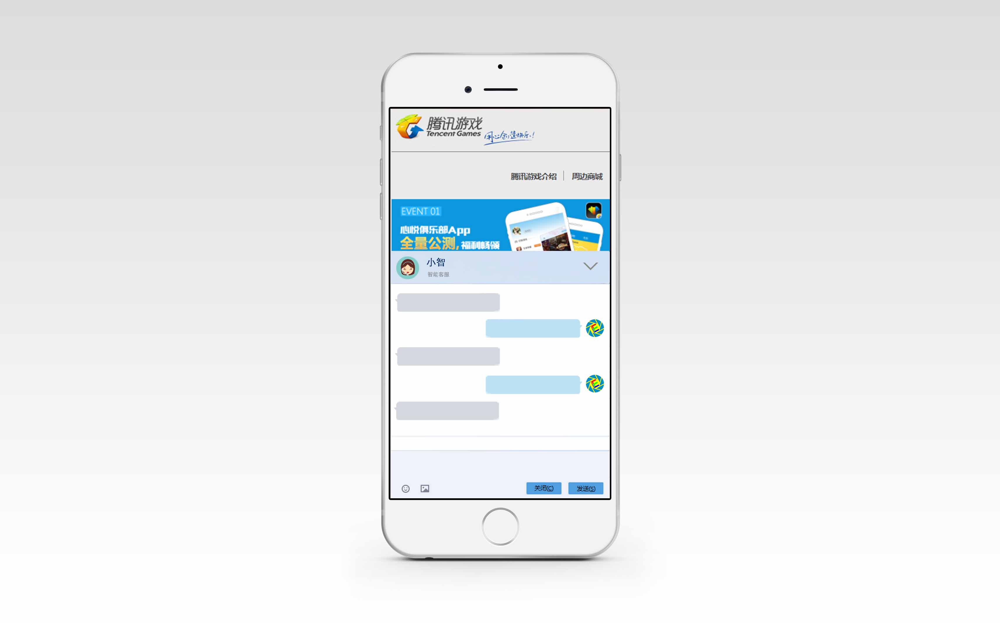

# cschat - 小智智能客服系统
## 1 安装配置 

> ```
> npm install
> npm start / npm run build
> npm run server
> ```

## 2 兼容性

websocket >= IE10

UI >= IE9


## 3 效果图


效果图01



效果图02



效果图03



效果图04



## 4 特性

1. 即插即用，仅需引入一个js文件，即可实现效果
2. 使用websocket，实现数据的 pull，push
3. 区分PC端和移动端，加载不同样式
4. 其他特色功能：用户画像、战报数据推送……

## 5 支持的消息数据类型

1. 文本
2. 图片（二进制 base64）
3. 表情（正则替换）

## 6 技术选型

### 6.1 前端

1. 使用 webpack 构建
2. react 实现组件化和模板渲染
3. bootstrap 快速搭建 UI

### 6.2 后端

1. nodejs (首选)
2. go

## 7 数据处理

### 7.1 数据流

（聊天和推送数据是否存入数据库）

### 7.2 数据结构

（图片文件的处理）

### 7.3 数据额外处理

1. 敏感信息过滤
2. 表情包正则替换